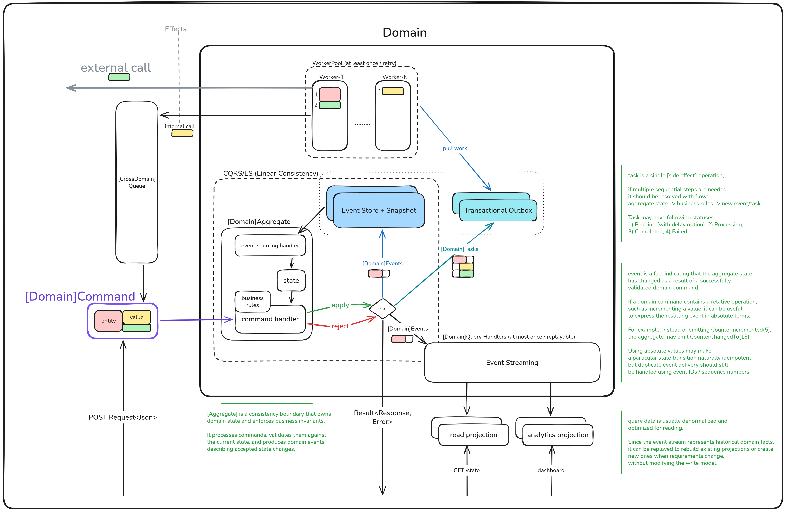
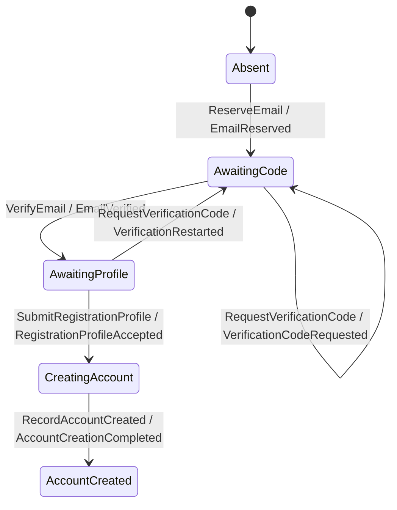
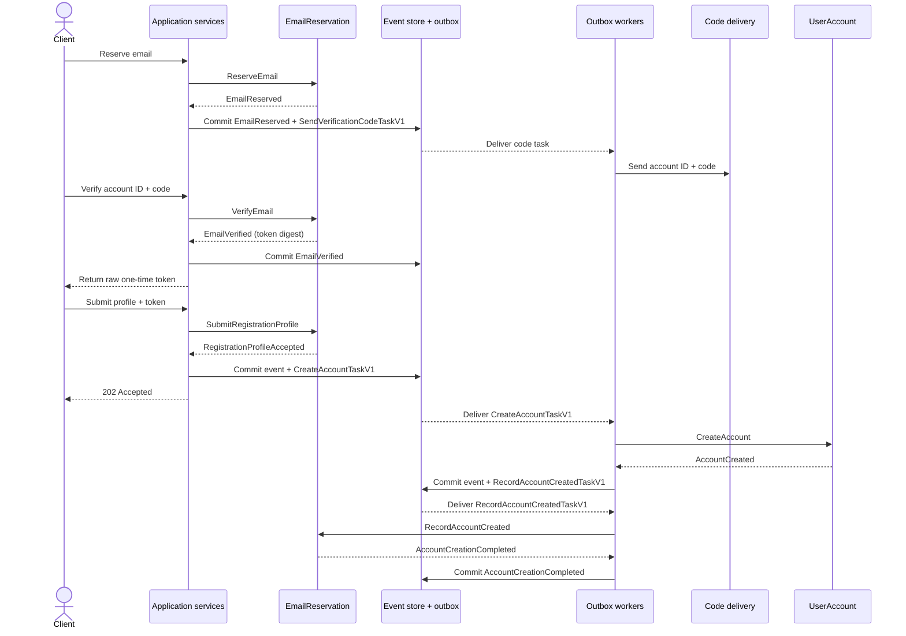

# Account Management Service

This repository is a compact case study in Domain-Driven Design (DDD), Event
Sourcing, CQRS, and reliable asynchronous coordination with a transactional
outbox. It models registration as two consistency boundaries: reserving and
verifying an email, then creating an immutable user account.

## The problem

Registration must reserve a canonical email, prove access to it with a
seven-digit verification code, issue a one-time account-creation token, accept
a valid profile, and create the account asynchronously. Concurrent requests,
lost responses, worker restarts, and repeated task delivery must not create a
second account or repeat a completed transition.

One aggregate identity cannot provide both required guarantees:

- If the aggregate ID is the canonical email, commands for that address are
  serialized and uniqueness can be enforced, but the account's identity becomes
  its email. Changing the email would require changing the aggregate ID and
  moving or replacing its event stream.
- If the aggregate ID is a UUID, the account has a stable identity independent
  of its email, but two UUID-keyed aggregates can concurrently claim the same
  address. Aggregate-local consistency cannot guarantee email uniqueness across
  those streams.

The model therefore uses two aggregates. `EmailReservation` is keyed by
canonical email and owns uniqueness and verification. `UserAccount` is keyed
by UUID and owns the stable account record. Email changes are not implemented
in this case study, but the account identity is not coupled to the address.

## Architectural approach

- **DDD** puts the rules inside the `EmailReservation` and `UserAccount`
  aggregates. Each aggregate protects its own transaction boundary.
- **Event Sourcing** stores accepted changes as immutable domain events and
  rebuilds aggregate state by replaying them. A rejected command emits no event
  and therefore leaves state unchanged.
- **CQRS** sends writes through commands and aggregates; read models can be
  projected independently from their event streams.
- **Transactional outbox** commits a domain event and its follow-up task in the
  same PostgreSQL transaction. Workers may deliver tasks more than once, so
  continuation handlers make exact redelivery idempotent.



The aggregates never call or mutate each other. Application services issue
commands, and durable outbox tasks carry facts between the two event streams.

## Domain model

### `EmailReservation`

This aggregate is a registration lock and workflow keyed by canonical email.
It owns email uniqueness, the active verification proof, the one-time profile
right, and the account-creation phase. It does not create `UserAccount`
directly.

#### Commands and tasks

| Kind | Name | Responsibility |
|---|---|---|
| Command | `ReserveEmail` | Starts an absent reservation with the application-generated account ID and verification code. |
| Command | `RequestVerificationCode` | Replaces the active account ID/code pair, or restarts verification and revokes an unspent token. |
| Command | `VerifyEmail` | Verifies the current account ID/code pair and records only the token digest. |
| Command | `SubmitRegistrationProfile` | Validates the current token and profile, consumes the token, and starts account creation. |
| Command | `RecordAccountCreated` | Accepts a matching account-creation fact and completes the reservation workflow. |
| Outgoing task | `SendVerificationCodeTaskV1` | Performs one external delivery of the exact account ID/code pair committed with the issuance event. |
| Outgoing task | `CreateAccountTaskV1` | Carries the canonical email, account ID, and accepted profile to the `UserAccount` command handler. |
| Incoming task | `RecordAccountCreatedTaskV1` | Carries the created account fact back from the `UserAccount` flow. |

Tasks are application contracts, not aggregate internals. The application
commits each outgoing task atomically with the domain event that made the work
necessary.

#### State model



#### Invariants

Its principal invariants are:

- Emails are trimmed and lowercased before the canonical value is used as the
  aggregate key.
- A verification code has exactly seven decimal digits.
- Only the latest issued account ID/code pair is valid. A reissue must use a
  new account ID, although the numeric code itself may happen to repeat.
- `EmailVerified` stores only a digest of the account-creation token. The raw
  token is returned once after the event commits and is never stored in the
  aggregate or outbox.
- The token can accept only one profile. Acceptance records its consumed digest
  and moves the aggregate to `CreatingAccount`.
- First and last names are trimmed and non-empty, and the date of birth cannot
  be later than the profile's validation date.
- Once profile submission starts account creation, registration and code
  issuance cannot be started again for that email.

### `UserAccount`

This aggregate is keyed by account UUID and owns the immutable account record.
Its identity is stable and independent of the canonical email used during
registration.

#### Commands and tasks

| Kind | Name | Responsibility |
|---|---|---|
| Incoming task | `CreateAccountTaskV1` | Carries the canonical email, account ID, and accepted profile from `EmailReservation`. |
| Command | `CreateAccount` | Validates and creates the account once, or classifies an exact retry separately from conflicting data. |
| Outgoing task | `RecordAccountCreatedTaskV1` | Carries the committed creation fact back to `EmailReservation` for workflow completion. |

`AccountCreated` and `RecordAccountCreatedTaskV1` are committed atomically.
The aggregate itself emits only the event; the application and persistence
boundary attach the task.

#### Invariants

Its principal invariants are:

- An account is created once and its recorded data is immutable.
- First and last names are trimmed and non-empty.
- The date of birth cannot be later than the validation date.
- A repeated `CreateAccount` with different account data is rejected as
  `AlreadyExistsWithDifferentData`.

A delivery that matches the stored account data is still rejected by the
aggregate as `AlreadyCreated` and emits no second event. The application
handler treats that specific rejection as successful idempotent delivery. The
comparison deliberately ignores a newly supplied `created_at`: replay keeps
the original creation time.

## Registration flow



1. The client reserves an email; the application generates an account ID and
   verification code and sends `ReserveEmail` to `EmailReservation`.
2. `EmailReserved` and `SendVerificationCodeTaskV1` commit atomically.
3. A worker delivers the stored account ID/code pair, and the client verifies
   the current pair with `VerifyEmail`.
4. After `EmailVerified` commits with only the token digest, the application
   returns the raw one-time account-creation token.
5. The profile and token are submitted. `RegistrationProfileAccepted` and
   `CreateAccountTaskV1` commit atomically, consuming the token.
6. A worker delivers the task and sends `CreateAccount` to `UserAccount`, which
   records `AccountCreated`.
7. `AccountCreated` and `RecordAccountCreatedTaskV1` commit atomically.
8. A worker sends `RecordAccountCreated` back through the application boundary;
   `EmailReservation` records `AccountCreationCompleted` and reaches
   `AccountCreated`.

These retries have intentionally different contracts: repeating the public
profile-submission request with a consumed token is forbidden, while
redelivery of an already completed internal outbox task is expected and is
treated as success when its data exactly matches the recorded fact. A `202
Accepted` response means the profile event and account-creation task are
durable, not that account creation has finished. The registration-status
projection is not implemented yet.

## Retry budgets

Retries are split by what is being repeated. Each layer owns only its own
failure class and must not repeat the same error again at an adjacent layer.

| Layer | Repeated unit | Budget |
|---|---|---|
| Fast CQRS retry | The same aggregate command with the same prebuilt outbox tasks after an optimistic conflict | Up to 3 total attempts |
| Durable outbox retry | Delivery of the same persisted task after a retryable handler outcome | Up to 10 deliveries |

Application workflows issue one generated command. Even an
`AccountIdUnchanged` UUID collision is returned as a conflict rather than
generating another command. An outbox task may cause up to `10 × 3` command
executions across its durable deliveries. Connection loss, timeout,
deserialization, and unavailable errors are not retried by the fast CQRS layer
because the commit outcome can be unknown.

## PostgreSQL

The Compose file runs PostgreSQL only:

```sh
docker compose up -d postgres
```

Stop it with:

```sh
docker compose down
```

## Build and run

Copy the local configuration template, adjust it if necessary, build the
release binary, and run it:

```sh
cp .env.example .env
cargo build --release
./target/release/account-management-service
```

## HTML coverage report

Generate and open the coverage report with:

```sh
cargo llvm-cov --html --open --ignore-filename-regex '(^|/)main\.rs$' --fail-under-lines 90
```

The generated entry point is `target/llvm-cov/html/index.html`.

## k6 load tests

With PostgreSQL and the release service running, the
[k6 guide](.k6/README.md) provides scenarios that generate both the built-in
k6 dashboard and a compact HTML status report, together with all supported
configuration options.
